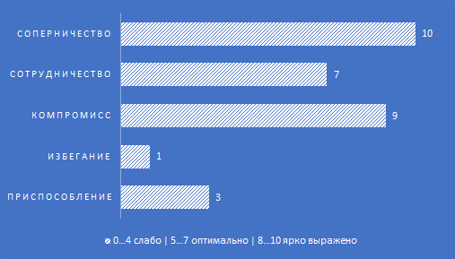

## Способы предотвращения и урегулирования конфликтов
### **Стратегия**
Пройдя тест на определение стратегии выясню, что характерно для меня в конфликтной ситуации.
### Поведение в конфликтной ситуации, TKI (Томас-Килманн)
По результатам можно сделать вывод, что 

