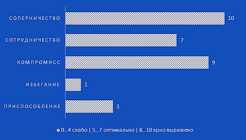

## Способы предотвращения и урегулирования конфликтов
### **Стратегия**
Пройдя тест на определение стратегии выясню, что характерно для меня в конфликтной ситуации.
### Поведение в конфликтной ситуации, **TKI** (Томас-Килманн)
По результатам можно сделать вывод, что основываюсь я на соперничестве, но и не забываю о компромиссе с сотрудничеством.  
Крайне плохо уступаю и не готов вовсе на избегание.  

#### **Что означают сами стратегии**

- **Соперничество** заключается в навязывании другой стороне предпочтительного для себя решения.
>Соперничество оправдано в случаях: явной конструктивности предлагаемого решения; выгодности результата для всей группы, организации, а не для отдельной личности или микрогруппы; важности исхода борьбы для проводящего данную стратегию; отсутствии времени на уговоры оппонента.
Соперничество целесообразно в экстремальных и принципиальных ситуациях, при дефиците времени и высокой вероятности опасных последствий.

- **Сотрудничество** считается наиболее эффективной стратегией поведения в конфликте. Оно предполагает направленность оппонентов на конструктивное обсуждение проблемы, рассмотрение другой стороны не как противника, а как союзника в поиске решения.
>Сотрудничество эффективно в ситуациях: сильной взаимозависимости оппонентов; склонности обоих игнорировать различие во власти; важности решения для обеих сторон; непредубежденности участников. Сочетание стратегий определяет, каким способом разрешится противоречие, лежащее в основе конфликта.

- **Компромисс** состоит в желании оппонентов завершить конфликт частичными уступками. Он характеризуется отказом от части ранее выдвигавшихся требований, готовностью признать претензии другой стороны частично обоснованными, готовностью простить.
>Компромисс эффективен в случаях: понимания оппонентом, что он и соперник обладают равными возможностями; наличия взаимоисключающих интересов; удовлетворения временным решением; угрозы потерять все. Сегодня компромисс – наиболее часто используемая стратегия завершения конфликтов.

- **Избегание** или уход от решения проблемы, или избегание, является попыткой уйти из конфликта при минимуме затрат. 
>Отличается от аналогичной стратегии поведения в ходе конфликта тем, что оппонент переходит к ней после неудачных попыток реализовать свои интересы с помощью активных стратегий. Собственно, разговор идет не о разрешении, а о затухании конфликта. Уход может быть вполне конструктивной реакцией на затянувшийся конфликт.
Избегание применяется при отсутствии сил и времени для решения противоречия, стремлении выиграть время, наличии трудностей в определении линии своего поведения, нежелании решать проблему вообще.

- **Приспособление** или уступка, рассматривается как вынужденный или добровольный отказ от борьбы и сдача своих позиций. 
>Принять такую стратегию оппонента вынуждают разные мотивы: осознание своей неправоты, необходимость сохранения хороших отношений с оппонентом, сильная зависимость от него; незначительность проблемы. Кроме того, к такому выходу из конфликта приводит значительный ущерб, полученный в ходе борьбы, угроза еще более серьезных негативных последствий, отсутствие шансов на другой исход, давление третьей стороны. В некоторых ситуациях с помощью уступки реализуется принцип «Три Д»: Дай Дорогу Дураку.
### Плюсы там, где их не должно быть
Хоть, согласно результатам, **приспособление** и не самая отрицаемая мной техника, но всё же именно её я выделил бы на свой взгляд, как наиболее неприменимой мной.  
Так как считаю, что как бы не было сложно, но каждый должен получить заслуженное и не стоит мериться с тем, что вам не по душе и приносит дискомфорт.  
Но даже если так, попробуем всё же выяснить, какие плюсы может нести такого рода подход.
#### **Положительные аспекты приспособления**  
(некоторые исключительно ситуативны)
1. Сохранение лица (фигурального)
2. Сохранение контакта и взаимоотношений с оппонентом
3. Минимизация потенциального ущерба
4. Минимизация в целом негативных последствий при отрицательном исходе
5. Сохранение времени при невозможности отстоять свою точку зрения (при минимальных потерях)
6. Можно попытаться использовать, в дальнейшем факт уступка для манипуляции
7. Возврат стабильности