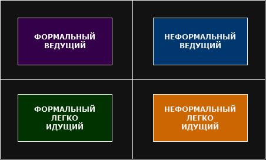

## Конфликт темпераментов и стилей коммуникации

**Для начала определю себя по методикам DISC и MBTI**
### **DISC**
Данный тест на типы личности называется **«DISC» (Dominance-Influence-Stability-Compliance)**.  
**Типология DISC** – это классификация психотипов: «доминация», «влияние», «стабильность», «система».
#### Чем же полезна система **DISC**?
Если собеседники или сотрудники относятся к разным поведенческим типам, то между ними возможны разногласия.   
Знание поведенческих типов личности, к которым принадлежат окружающие, коллеги по работе и даже друзья позволяет лучше выстраивать отношения, избегать неприятных ситуаций и, главное, достигать желаемых целей.  
Особенно полезно знать собственную типологию личности, чтобы качественно оценивать свои сильные и слабые стороны, понимать в каком направлении работать над собой.

Перейдём к результатам моего тестирования:
#### **Доминирующий (D)**

**D** – лидеры, руководители, достаточно авторитарные люди, которые знают, чего хотят, и не очень привыкли прислушиваться к чужому мнению. Они нетерпеливые, рискованные, склонны к быстрым, не всегда обдуманным решениям. Очень ценят своё время, не склонны к доверию и сочувствию.

**Девиз D: «пришёл, увидел, победил». Высказывания: «хватит думать, давайте делать»; «по ходу разберёмся».**

Людям с высоким фактором **D** свойственно быстро принимать решения. Они имеют грубую форму общения, прямолинейны, жёстки и самоуверенны. Они любят указывать окружающим, что им делать, раздавать команды. Очень целеустремлённы, готовы достигать своей цели, чего бы им это ни стоило. Они стремятся перевыполнить задание, чтоб проявить себя. Стараются не стоять на месте, им нужен результат и прогресс.

- **Сильные стороны D**: работа на результат, быстрая реакция, активная жизненная позиция. Они всегда отстаивают свою точку зрения. Им комфортно в меняющихся условиях, в ситуациях с вызовом.

- **Слабые стороны D**: тяжело находят подход к людям, слишком прямолинейны, им не хватает дипломатии. В погоне за результатом забывают детали, не обращают внимание на важные нюансы. В состоянии стресса склонны проявлять агрессию.

**D** могут быть хорошими руководителями, формальными лидерами. Их ценность для компании: ориентированы на прибыль, хорошие организаторы, легко принимают вызов.

Маркеры поведения такого типа:
- Потребность: **результат**
- Общее впечатление: **экстраверт, целеустремлённый**
- Способ общения: **прямой**
- Крайняя степень: **раздражительность, вспыльчивость**
- Жестикуляция: **активная, широкие жесты**
- Походка: **быстрая, устремляющаяся**
### **MBTI**
Суть системы психологического тестирования **MBTI** заключается в том, что, благодаря измерению уникальных комбинаций личностных факторов человека, можно предугадать его склонность к определённому виду деятельности, стиль его действий, характер решений и прочие особенности, позволяющие ему чувствовать себя комфортно и уверенно. 

Для чего и были придуманы 4 шкалы (дескриптора), по которым исследуется личность.
#### **Дескрипторы MBTI**
- ориентация сознания **интроверсия / экстраверсия**
- ориентация в ситуации **здравый смысл / интуиция**
- основа принятия решений **логос / пафоc**
- способ подготовки решений **рациональность / иррациональность**

Перейдём к результатам моего тестирования:
#### **ESTJ-A Менеджер / Администратор**
*"Я никогда не догадывался, кем окажусь в этой жизни, но я всегда знал, что рожден для чего-то большего."* - **Джон Рокфеллер**

**ESTJ** — практичные, инициативные, высокоорганизованные и целеустремленные люди, которые имеют твердые жизненные убеждения и стараются жить согласно своим высоким стандартам.  
Они избирают активную деятельность, направленную на взаимодействие с людьми.  
Ценят традиции, порядок и стабильность.

Люди с этим типом личности обычно преуспевает в организации и управлении людьми и часто занимают руководящие должности.  
Требовательные к себе, они столь же критично относятся и к другим.  
В первую очередь они ориентированы на выполнение задачи, поэтому не всегда достаточно осторожно обходятся с чувствами других и даже могут показаться агрессивными.
#### **Сильные стороны ESTJ:**

- **Организаторские способности** - это один из самых организованных типов личности. Они прекрасно организуют себя, других людей и рабочие процессы. У Администратора всё и все под контролем.

- **Дисциплинированность** - всегда укладываются в установленные сроки, следуют намеченному плану, проявляют деловой подход, стремятся выполнить задачу с первой попытки. Администратору можно доверить сложную задачу и быть уверенным, что он вложится в ее выполнение на 100%.
- **Надежность** - комфортно чувствуют себя в организационной структуре с четко распределенными ролями и обязанностями. Администраторы внимательно следуют инструкциям, выполняя свой функционал, используют проверенные методы для решения возникающих проблем, мониторят текущую процедуру и при необходимости вносят изменения.
- **Командность** - наслаждаются работой в команде, эффективно взаимодействуют с другими людьми, работая над задачами. Ведут других людей и организацию к достижению поставленных целей.
- **Решительность** - люди с этим типом личности берут на себя ответственность за решение задач. Они надежны, решительны, практичны и реалистичны. В своих поступках действуют прямо и смело.
- **Компетентность** - хорошо знают свой участок работы и отлично разбираются в нем. Они могут быть прекрасными учителями и наставниками в своем деле.
#### **Слабые стороны ESTJ:**
- **Негибкость и упрямство** - проблема с зацикленностью на том, что работает, заключается в том, что администраторы слишком часто отвергают то, что могло бы работать лучше. Все остается мнением, пока оно не доказано, а они неохотно доверяют мнению достаточно долго, чтобы у него появился такой шанс.

- **Дискомфорт в нестандартных ситуациях** - являются твердыми приверженцами традиций, и когда им внезапно приходится пробовать нестандартные решения, они чувствуют себя некомфортно и испытывают стресс. Новые идеи предполагают, что их методы были недостаточно хороши, и отказ от того, что всегда работало раньше, в пользу чего-то, что еще может потерпеть неудачу, ставит под угрозу их имидж надежности.
- **Склонность к суждениям** - имеют твердые убеждения в том, что правильно, что неправильно и социально приемлемо. Стремление к наведению порядка часто распространяется на всех и каждого, игнорируя возможность того, что есть два правильных способа добиться цели. Администраторы без колебаний сообщают этим “уклонистам”, что они думают, считая своим долгом все исправить.
- **Слишком сосредоточены на социальном статусе** - гордятся уважением своих друзей, коллег и сообщества и хотя это трудно признать, очень заботятся об общественном мнении. Менеджеры (особенно неспокойные) могут настолько увлечься оправданием ожиданий других, что не в состоянии удовлетворить свои собственные потребности.
- **Трудно расслабиться** - эта потребность в уважении порождает потребность сохранять свое достоинство, что может затруднить раскрепощение и расслабление из-за риска выглядеть дураком даже в хорошем веселье.
- **Трудности с выражением эмоций** - все это свидетельствует о самой большой слабости менеджеров: выражать эмоции и сопереживать. Люди с исполнительным типом личности настолько увлекаются фактами и наиболее эффективными методами, что забывают думать о том, что делает других счастливыми или о своей чувствительности. Объезд может быть потрясающе красивым, доставлять радость семье, но менеджеры могут увидеть последствия только в том, что прибудут в пункт назначения с опозданием на час, причинив боль своим близким, слишком резко отвергнув эту идею.

### Задача на определение возможного конфликта и выхода из него.  
Типы определённые ранее помодут быстрее определиться с приведёнными в данной матрице.  

