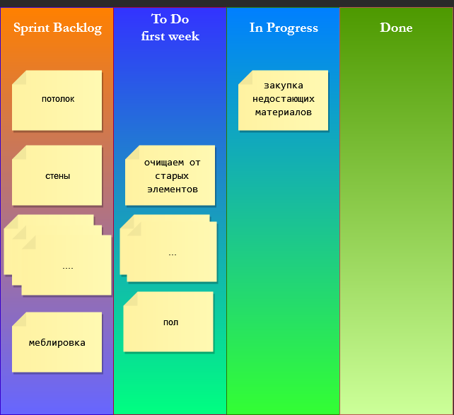

## SCRUM apartment renovation

### Руководствоваться необходимо будет принципами:  
- Работа короткими циклами (спрринтами)  
- Гибкость  
- Заказчик участвует в работах  
- Взаимодействие команды

### Организация работы:  
В начале распределяем роли, так как квартира находится в нашей собственности,  
мы являемся владельцем (Product Owner) далее PO,  
на роль скрам-мастера (Scrum Master) далее SM, определяем опытного товарища  
в сфере ремонта с достаточной коммуникабельностью.  
Остальные товарищи являются командой далее T.

#### PO:  
- формируем видение итога работ
- составляем смету работ
- составляем список понятных Т требований
- формируем бэклог (Backlog)

#### SM:
- следит за соблюдением фреймворка
- перед спринтом с T определяет задачи необходимые для реализации

#### **Backlog:**
1. Разделить помещение по рангу важности и очерёдности работ:
    - Кухня
    - Спальня 1
    - Зал
    - Санузел + Ванна
    - Спальня 2
    - Прихожая 
2. Отделка общих помещений проходит по алгоритму:  
2.1 очищаем от старой мебели (ненужной)  
2.2 остальное переносится в буферное помещение  
2.3 демонтаж старой отделки  
2.4 работа с проводкой  
2.5 пол  
2.6 потолок  
2.7 стены  
2.8 освещение  
2.9 меблировка   
3. Отделка технических помещений проходит по алгоритму:  
3.1 очищаем от старых элементов или рабочих поверхностей  
3.2 остальное переносится в буферное помещение  
3.3 демонтаж старой отделки  
3.4 работа с проводкой  
3.5 пол  
3.6 потолок  
3.7 стены  
3.8 освещение  
3.9 сантехнические работы  
3.10 меблировка
4. Задаются по помещениям:
    - схемы разводки
    - материалы
    - цвета
    - элементы
    - мебель

(для кухни, ванны и санузла указываются поставщики услуг сопутствующих)  
#### -
С SM и T согласуется разбитие на спринты всего проекта, рабочим вариантом   
можно избрать 1 помещение(комната) = 1 спринту,  
исключение ванна с санузлом делаются совместно.  

Спринт 1 “Кухня”  
Спринт 2 “Спальня 1”  
Спринт 3 “Зал”  
Спринт 4 “Санузел + Ванна”  
Спринт 5 “Спальня 2”  
Спринт 6 “Прихожая”  

Уточняются все возникшие вопросы в текущем периоде, выслушиваются предложения и вносятся коррективы по согласию сторон.

Каждый спринт начинается с планирования  
Все члены команды собираются, оценивают бэклог продукта в целом и выбирают  
приоритетные задачи для спринта = бэклог текущего спринта  
На основании бэклога обсуждается объем работ и сроки спринта  
Определяется ожидаемый результат спринта  

Риски связаны с привлечением сторонних работников на некоторые элементы ванной, санузла и кухни.  
### Спринт 1 “Кухня”
#### **Sprint Backlog**
1. закупка недостающих материалов
2. очищаем от старых элементов или рабочих поверхностей  
3. всё что останется, переносится в буферное помещение  
4. демонтаж старой отделки  
5. работа с проводкой  
6. пол  
7. потолок  
8. стены  
9. освещение  
10. сантехнические работы  
11. меблировка

#### **SCRUM bord**

  

#### SM:  
На всём этапе проводит степдапы каждый день  
Контролирует инициативность и самостоятельность всех членов команды  
Следит за удовлетворенностью командой получаемыми результатами  
Налаживает атмосферу в коллективе  
Контролирует итоги работы команды  
Обозначает проблемы и открытые вопросы  
Отвечает за взаимодействие всех членов команды между собой  
Участвует во всех встречах  
Поддерживает работоспособность команды на высоком уровне  
Устраняет проблемы  
Следит за следованием намеченному графику работ

#### Подведение итогов спринта:
- После окончания спринта Т проверяет выполненную часть работ по проекту
- РО собирает обратную связь
- Принимаются решения для успешной работы в дальнейшем
- Формируется бэклог следующего спринта

И так до получения конечного продукта.
Так же проводится ещё одно мероприятие.

#### Ретроспектива спринта:
- Обзор завершенных этапов
- Т рассматривает результаты, обсуждает нюансы спринта и сопутствующих процессов
- Извлекаются уроки

Основная задача – привлечь внимание команды к успехам и неудачам спринта.  

Главное не акцентировать ошибки = не искать виноватого, а использовать ценный опыт из прошлого спринта.