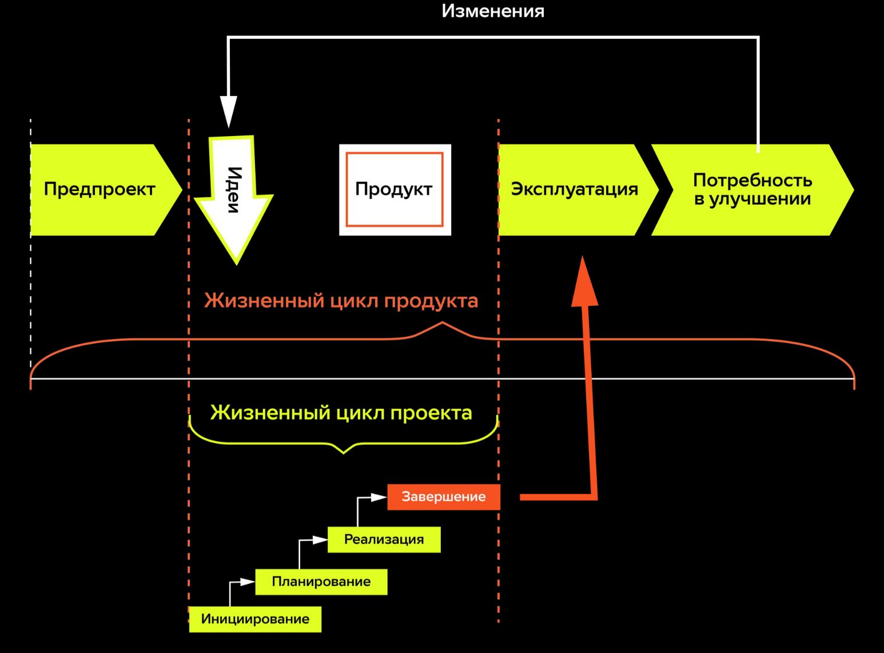
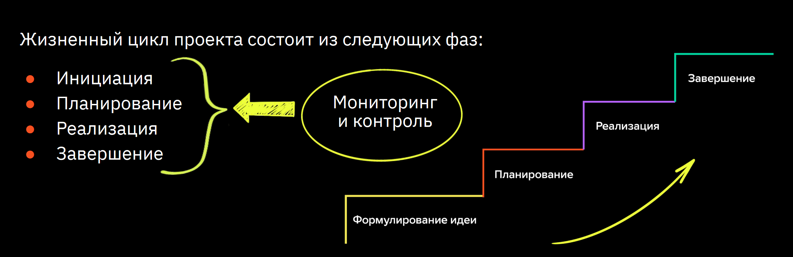

## Жизненный цикл проекта
### Что такое жизненный цикл проекта

>В компании есть проект по разработке внутреннего программного обеспечения для проектирования зданий и сооружений. 
>Вас назначают Project manager-ом (далее – PM) на данный проект, а вашего коллегу из соответствующего отдела заказчика – Product owner-ом (далее – PO).

1. Опишите, что входит в обязанности PM и PO по данному проекту.
- **PO** :
    - профессионал, в обязанности которого входит создание
и поддержание оптимальной ценности продукта на протяжении
его жизненного цикла
    - отвечает за процесс генерации, планирования, разработки, тестирования,
запуска и вывода продукта на рынок
- **PM** :
    - профессионал, осуществляющий управление проектом, командой проекта
и ответственный за достижение целей проекта
    - ответственен за приложение знаний, навыков, инструментов и методов к работам проекта
для удовлетворения требований, предъявляемых к проекту.

На основании этого мой коллега формирует требования к продукту исходя из которых мы вместе подготавливаем ТЗ на проект, далее я выбираю методы ведения проекта, руковожу командой опираясь на максимальное удовлетворение предъявленным требованиям, собирая обратную связь от всех заинтересованных лиц, после чего коллега интегрирует продукт в сетку работ компании.

2. Кто из них будет отвечать за создание продукта?
- За создание **будет отвечать PO**.
3. Опишите Жизненный цикл продукта и Жизненный цикл проекта.
- **Жизненный цикл продукта** – это период времени, который начинается с момента принятия решения о необходимости
создания продукта и заканчивается в момент его полного изъятия из эксплуатации.

 

- **Жизненный цикл проекта** – это набор фаз, через которые проходит проект с момента
его начала до момента завершения.

 